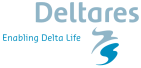

# Voorwoord

```{r, include=FALSE}
options(tinytex.verbose = TRUE)

concept = FALSE # bij FALSE wordt een versie gemaakt zonder disclaimer

```

```{r, message=FALSE, warning=FALSE, include=FALSE}

knitr::opts_chunk$set(echo = FALSE,	message = FALSE, warning = FALSE)
```


<!-- ```{r logos, fig.height=2, fig.width=3, out.width="33%", include=F} -->

<!--  -->
<!--  -->
<!-- knitr::include_graphics("www/Rijkswaterstaat-logo-e1473888123824-1-300x300.jpg") -->
<!-- ``` -->

```{asis, echo = concept}

cat("## Disclaimer concept systeemrapportage.  
    
    De informatie op deze website is op dit moment onder constructie en bedoeld voor een beperkt publiek. Niets van deze website mag worden gebruikt door derden. De voor deze concept systeemrapportage gebruikte data kan bij de bronhouder opgevraagd worden. Voor formeel gebruik en formele referentie wordt verwezen naar de [DeltaExpertise wiki](https://www.deltaexpertise.nl/) waar de vigerende definitieve systeemrapportage is gepubliceerd.")
```


Deze watersysteemrapportage is een initiatief van

* Rijkswaterstaat
    + Zee en Delta
    + WVL
* Deltares
* Wageningen Marine Research


## Laatste wijzigingen

datum  |  wijziging
--------|-------
Okt 2022 | Korrelgrootte bodem toegevoegd. nieuwe versie online
Feb 2022 | Waterkwaliteit hoofdstuk aangepast, verder suggesties RWS verwerkt
Jan 2022 | Baggerlocaties hoofdstuk toegevoegd
Dec 2021 | Vogels HS aangevuld, waterkwaliteit HS aangevuld, suggesties RWS verwerkt
Okt 2021 | Kaart en lijst met kunstwerken toegevoegd, RWS links aangepast
Jan 2020 | WQ aangevuld tm 2018
Jan 2020 | Tekst Waterkwaliteit aangevuld
Jan2020 | Trends vogels per deelgebied toegevoegd
Jan2020 | Waterkwaliteit aangevuld met Si en E uit DDL (daarvoor niet beschikbaar)
